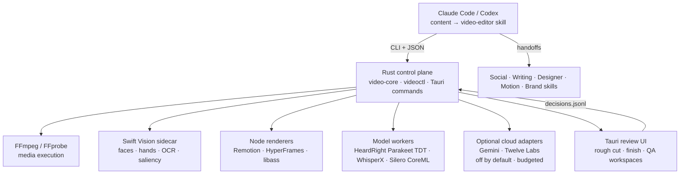

# CutRight — Agentic Video Editing Engine
## Architecture & End-to-End Implementation Guide

**Date:** 2026-07-26
**Author:** Claude (Fable 5), elevating `solcontent-video-engine-implementation-plan-2026-07-25.md` (Saul)
**Status:** HISTORICAL — the original hand-off plan, kept because later specs cite its section
numbers. It is **not** the as-built description. For current state read [`STATUS.md`](STATUS.md);
for the active campaign read `CUTRIGHT-FINAL-CONSOLIDATED-IMPLEMENTATION-PLAN-2026-07-30-REV2.md`.
**Target machine:** Adrian's Mac (Apple Silicon), macOS 15+

> **Two corrections before you read further.**
>
> 1. **The transcription provider is HeardRight, not ScrapeRight.** Every
>    `scraperight` / `scraperight-engine` reference below — including the §3 bridge commands and
>    the §14 Phase 1 description — is superseded by the HeardRight engine boundary
>    (`CUTRIGHT_HEARDRIGHT_ENGINE`, capability handshake, no model-directory knowledge).
> 2. **Much of this is built.** Phases 1–2 and the Phase 3 review surface exist; the §3 bridge
>    workflow is a pre-build path, not the current product path. Do not treat any section here as
>    a statement about what does or does not exist today.

---

## 0. How to read this document

Saul's plan is architecturally sound and this document keeps its spine: Rust control plane, immutable sources, VAD-as-signal-not-edit, provider adapters with local fallback, one installable skill, phased delivery. What this document adds:

1. **Decisions on Adrian's open questions** (§1) — GenRight vs separate tool, Rust/Tauri, V-JEPA 2, Twelve Labs/Gemini roles, transcription path.
2. **A Bridge Workflow (§3)** so Adrian can start making videos **tomorrow** with the tools already on disk, while the engine is built.
3. **The Craft Layer (§8)** — Adrian has never edited video. The editorial judgment a human editor carries in their head is written down here as explicit defaults (pacing, cut grammar, zoom grammar, captions, sound design, loudness, color). The cutaway/finish skills' battle-tested techniques are folded in verbatim where they are correct.
4. **Workspace integration map (§9)** — exactly which existing tools, skills, and gates this engine plugs into, so the implementation agent reuses instead of rebuilding.
5. **Corrections to Saul's plan** where research moved (§2.4) and a sharper build order (§14) with per-phase agent instructions.

Where this document and Saul's plan disagree, this document wins. Where this document is silent, Saul's plan §4–§23 remains authoritative (schemas, CLI contract, QA gates, licensing).



---

# 1. Decisions on Adrian's open questions

## 1.1 Separate tool, not inside GenRight — **decided: separate repo**

GenRight is the Tauri console for **API-driven media generation** (the media-console successor: image/video generation pipelines, provider galleries, paid-API orchestration). The editing engine is **post-production on captured footage**: different data model (timelines, immutable sources, word-level transcripts), different lifecycle (long-running local jobs, no per-asset paid API in the default path), different UI (waveform/transcript/timeline review vs generation galleries).

Merging them would couple a fast-moving generation console to a correctness-critical timeline engine and make both harder to test. Instead:

- **New top-level repo: `cutright/`** (Right Suite naming keeps the door open to productize later; rename is Adrian's call — the repo name is the only thing that would change).
- Shares the **`Content/` artifact root** convention with GenRight for finished deliverables.
- Reuses GenRight's proven repo patterns: Tauri + Rust sidecar shape, `scripts/build-guard.mjs` (§13A build-concurrency rule), dev-baseline tooling (`tools/templates/dev-baseline/`), and the shared QA skill contract (`tools/skills/qa`).
- If a generated asset (B-roll clip, AI image) is ever needed inside an edit, the edit engine consumes a **file** produced by the existing generation pipeline / GenRight — it never calls generation APIs itself. One-way dependency, by file.

## 1.2 Rust + Tauri — **decided: yes, with the exact split Saul specified**

- **Rust owns** correctness: project state, schema validation, timeline arithmetic, hashing/caching, job graph, provider routing, budget enforcement, FFmpeg invocation. This is the part that must never be improvised by an LLM.
- **Tauri is a thin review surface only** (rough-cut review, finish review, QA review). It is NOT the media engine and NOT required for the CLI to work — `videoctl` must be fully usable headless by the agent before any UI exists (the UI lands in Phase 3, after the first useful milestone).
- **Sidecars** for everything with a mature ecosystem: FFmpeg, Node (Remotion/HyperFrames), Swift (Apple Vision), Python (WhisperX; optional NeMo). Do not rewrite any of these in Rust.

## 1.3 Where it lives in the skill system — one specialist branch under `content`

```text
tools/skills/content/specialists/video-editor/
├── SKILL.md              # the only installable front matter
├── workflows/            # ingest.md · rough-cut.md · shorts.md · finish.md · review.md · export.md
├── references/           # craft primer (from §8), effect catalog usage, provider policy
└── schemas/
```

The `content` router (`tools/skills/content/SKILL.md`) gets one new route row: *"Edit captured footage into YouTube/Reels/TikTok deliverables → `specialists/video-editor/SKILL.md`"*. The third-party `cutaway`/`finish` skills stay installed at `~/.claude/skills/` for the bridge period (§3) and are retired when Phase 2 and Phase 5 respectively pass their gates.

Ownership boundaries (unchanged from Saul §7.2): Social owns platform/hook/CTA/packaging, Writing owns scripts and on-screen wording, Designer owns thumbnails and static layouts, Motion owns cinematic motion language, the Remotion specialist owns Remotion correctness, demo-recorder stays a separate lane, `/brand <venture>` loads before any content work.

## 1.4 Transcription — HeardRight Parakeet TDT primary, WhisperX as the alignment verifier

This is the one place Adrian's workspace is genuinely ahead of the field: HeardRight already ships a **locked, local, agent-usable Parakeet TDT v3 path with a CoreML bundle on this Mac** (`heardright/model_registry/coreml/parakeet-tdt-v3/`, through `heardright-engine`). It is the local dictation pipeline Adrian has explicitly designated as locked and loaded for CutRight.

But the cutaway skill's hardest-won lesson (its "dead ends" section) is that **cut placement lives or dies on word-edge accuracy**, and that plain ASR word timestamps drift around pauses. Parakeet's TDT decoder emits native word timestamps that are architecturally better than Whisper's (duration-transducer, not attention heuristics) — but "better" is not "verified on Adrian's footage."

**Decision — dual path with a benchmark gate:**

| Role | Provider | Why |
|---|---|---|
| Primary transcript + word timestamps | **HeardRight `heardright-engine` (Parakeet TDT v3, CoreML)** | Already local, already locked, zero cost, native timed words |
| Alignment verifier / fallback | **WhisperX** (Python 3.11 venv, wav2vec2 phoneme forced alignment) | The cutaway skill's proven word-edge engine; sub-100 ms alignment |
| Cloud fallback (optional) | ElevenLabs Scribe or AssemblyAI behind the `TranscriptionProvider` trait | Only when local is unavailable; off by default |

Phase 1 includes `videoctl bench transcribe`: run both local providers on 3 real clips, cut 20 word-boundary edits from each provider's timestamps, render, and count clipped/early-start words. **Whichever provider produces zero clipped words at ±40 ms padding becomes the default cut-timestamp source; the other becomes the QA cross-check** (the second-ASR ghost-word gate from Saul §17.1 falls out of this for free — two independent engines disagree loudly when a cut eats a word). Do not assume the answer; measure it on Adrian's mic, room, and speaking style.

## 1.5 Silero VAD — yes, as Saul specified

The macOS implementation uses the shipped Silero CoreML bundle through a tiny native worker: recurrent frame probabilities are stored on the original timebase, profiles are calibrated on Adrian's footage, and VAD is never a destructive pre-edit. Saul §2.2/§2.4 stands unmodified — it is the single most important architectural correction to the Perplexity/Gemini drafts.

## 1.6 Gemini and Twelve Labs — optional, role-separated, current API facts

Both remain **off-by-default adapters** behind traits (Saul §15). Verified current facts to pin at implementation:

- **Gemini video understanding:** samples at **1 fps default, now configurable** (raise fps for fast-motion passes); ~300 tokens/sec of video (258/frame + 32/sec audio); timestamps referenced as MM:SS; schema-constrained JSON output supported; use the current Interactions API conventions. Role: one-shot semantic analysis, OCR-rich inspection, final-render audit. Never the timestamp authority (Saul §2.6 stands).
- **Twelve Labs:** **Marengo 2.7 was sunset 2026-03-30; Marengo 3.0 is GA.** Pegasus analyze endpoints handle videos up to ~2 h async. Indicative pricing to re-verify at build time: ~$0.042/min indexing, ~$0.021/min analyze input. Role: persistent searchable footage archive + timestamped segmentation of long recordings. Worth enabling once Adrian has >10 h of accumulated footage; not needed for the first weeks.
- Direct typed HTTP adapters, not MCP, for production runs (Saul §2.7 stands).

**Cost posture:** the default pipeline spends $0. A fully cloud-assisted 20-minute project (Gemini semantic pass + final audit) should run low single-digit dollars; Twelve Labs indexing of a 10 h archive ≈ $25 one-time. Budget caps per project (`max_budget_usd`) enforced in Rust, keys in macOS Keychain.

## 1.7 V-JEPA 2 — **rejected for v1 production; optional research plugin later**

Adrian asked about "V2 for predicting behavior" — Meta's **V-JEPA 2** world model. What it actually is: a self-supervised video encoder trained on ~1 M hours of video, strong at motion understanding and **action anticipation** (e.g. Epic-Kitchens-100 anticipation), used for robot planning and video QA when aligned with an LLM. What it is not: an editing-quality, engagement, or retention model. It ships no head that maps footage → "this cut is good" or "viewers will stay."

Verdict — same class as Saul's TRIBE rejection (§2.5), for the same reasons: any mapping from V-JEPA 2 embeddings to editing decisions would be an invented, unvalidated reduction, and it adds a heavy PyTorch runtime to a pipeline whose visual-evidence needs are already covered by Apple Vision + scene detection + the agent's own frame inspection.

Legitimate future slot (Phase 9+, `experimental` mode only): V-JEPA 2 as a **local embedding backbone** for semantic B-roll search over Adrian's own archive (the offline alternative to Twelve Labs) and for motion-similarity clustering. Gate any such use on a labeled evaluation against Adrian's actual preferences, and verify the model license permits the use before integrating. The *real* engagement model remains the one Saul specified: Adrian's own YouTube/IG retention analytics imported through Social (Phase 9).

## 1.8 The `cutaway` / `finish` creator skills — absorb the method, retire the scripts

These two skills are the most valuable thing in the `videoedit/` folder because they encode **battle-tested craft with documented dead ends**. Disposition:

| Asset | Disposition |
|---|---|
| WhisperX forced-alignment insight + dead-end list | Absorb into Phase 1/2 design and §8.1; the "what did not work" list becomes test cases |
| The GAP dial (0.22 s default no-word-gap threshold) | Becomes `gap_threshold_ms` in the cut-plan schema, per-variant (tight ≈ 220 ms, natural ≈ 350–450 ms) |
| Red-thread editorial method (beats, one-take-per-beat, later-take-wins, keep-content/drop-meta rules) | Becomes the rough-cut workflow prompt in `workflows/rough-cut.md`; `beats.txt` is formalized as `edit/candidates.json` |
| Zoom grammar (hook pull-back curve, punch wave, center-lock rule, gated blur) | Becomes the first motion effects in the registry (§8.2) with the exact curves |
| Exponential text fade + authority stack | Becomes caption/text effect components (§8.3) |
| SFX peak-alignment + sound-matches-motion + `reverb_throw.sh` | Becomes §8.4 rules; the SoX reverb-throw script is vendored as-is (it works; ffmpeg `afir` is broken in many builds — keep that note) |
| Parallax rule, asset rules 0–5, layout discipline | Becomes finish-plan validation rules (§8.5) |
| The Python cut scripts (`build_wx.py` etc.) | Reference implementations for Phase 2's Rust timeline compiler tests; not shipped |
| Editor-branch logic (Resolve/Premiere) | Dropped for v1 (direct MP4 output is the product); OTIO export covers NLE interchange later |

---

# 2. Field survey — what exists, what to take, what to skip

## 2.1 Directly reusable (license-clean)

| Project | License | Take |
|---|---|---|
| **browser-use/video-use** | MIT | The core efficiency architecture, proven in the wild: the LLM never watches video — it reads a word-level transcript (~12 KB) plus **filmstrip+waveform composite PNGs generated only at decision points**, then self-inspects the render. Adapt: transcript packing format, decision-point composite generation, rendered-output self-evaluation loop. Its ElevenLabs-Scribe dependency is replaced by our local providers. |
| **heygen-com/hyperframes** | Apache 2.0 | Deterministic HTML→MP4 rendering with 19 agent skills (`npx skills add heygen-com/hyperframes --full-depth`). Use as installed external renderer for bespoke one-off graphics; never fork. |
| **Remotion** (already a workspace specialist) | Custom (free ≤3-person teams; re-verify before ever productizing CutRight) | Primary renderer for the permanent branded effect library. The full rules KB already exists at `tools/skills/content/specialists/remotion/`. |
| **silero-vad** | MIT | The VAD signal, via ONNX Runtime from Rust. |
| **Auto-Editor** | Public domain/Unlicense (pin + audit exact version; recent releases add license-key behavior for some features) | Reference for silence/motion analysis heuristics; possibly a Phase-1 stopgap CLI. Not a core dependency. |
| **SoX** (reverb throw) | GPL (invoked as external binary — fine) | `reverb_throw.sh` vendored from the finish skill. |

## 2.2 Architectural references only

- **AgriciDaniel/claude-shorts** — longform→shorts pipeline with segment scoring and Remotion captions; mirrors our Phase 6 design. Read for its scoring rubric and interactive candidate-presentation flow.
- **hassancs91/claude-youtube-editor** — full record→publish pipeline (MIT per repo; audit before lifting code); useful for its end-to-end prompt structure.
- **PyAutoflip / KazKozDev/auto-vertical-reframe** — saliency-aware 9:16 reframing. Their approach (detect → rank subjects → smooth camera path) validates our design, but both drag in Python CV stacks (YOLO/MediaPipe). We get the same signals from the **Apple Vision Swift sidecar** (faces, saliency, tracking) with zero new runtime. Fall back to PyAutoflip only if Vision-based reframing fails its Phase 7 gate.
- **Descript / OpusClip / AutoCut** (commercial) — feature bar to meet: text-based editing, filler-word removal, auto-captions, auto-reframe. Our differentiators: local-first, agent-driven, brand-locked effect library, full provenance.

## 2.3 Rejected

- **TRIBE** (Saul §2.5) and **V-JEPA 2 as engagement/production gate** (§1.7 above).
- **MCP-first architecture** (Saul §2.8) — CLI first; MCP wrapper only after schemas stabilize.
- **Destructive VAD pre-stitching** (Saul §2.2).
- **Resolve/Premiere branches** for v1 — Adrian has no NLE habit to preserve; finished MP4s are the product. OTIO/FCPXML export is a later escape hatch (Saul §3.2).

## 2.4 Corrections to Saul's plan from post-plan research

1. **Twelve Labs:** "Pegasus 1.5" and Marengo status move fast — Marengo 3.0 is GA and 2.7 is dead. Code against capability discovery, pin model IDs at build time (Saul anticipated this; now confirmed).
2. **Gemini fps is configurable now** — the "1 fps, low-bitrate audio" constraint Saul cited is the *default*, not a ceiling. This slightly upgrades Gemini's usefulness for motion-heavy QA passes, but the "never the timestamp authority" rule stands.
3. **Parakeet TDT timestamps deserve first-class trust, pending the bench** — Saul treated Parakeet as "one provider among five" and rejected only the fake "<10 ms" claim. Correct — but the workspace's CoreML TDT path plus TDT's native duration-decoder timestamps make it the *presumptive* primary, with WhisperX as verifier (§1.4), not merely an option.
4. **`video-use` numbers confirmed** — the transcript-first economics (~12 KB text vs millions of frame tokens) are real and current; its self-inspection loop should be copied more aggressively than Saul's plan implies (it becomes our editorial QA loop seed).

---

# 3. Bridge Workflow — making videos from tomorrow, before the engine exists

Adrian starts shooting tomorrow. The engine's first useful milestone (Phase 2) is weeks away. Everything needed for a manual-but-agent-assisted workflow is already on disk. **This section is the standing workflow until Phase 2 passes its gate.**

## 3.1 One-time setup (30 minutes)

```bash
# 1. WhisperX venv (the cutaway skill's engine)
python3.11 -m venv ~/wx-env && ~/wx-env/bin/pip install whisperx
export HF_HOME=~/wx-cache   # first run downloads ~360 MB alignment model

# 2. Install the two creator skills
cp -R /Volumes/D/claude/videoedit/cutaway ~/.claude/skills/shortform-cutaway
cp -R /Volumes/D/claude/videoedit/finish  ~/.claude/skills/shortform-finish

# 3. SoX for the reverb throw
brew install sox

# 4. Verify ffmpeg + ScrapeRight engine
ffmpeg -version | head -1
cd /Volumes/D/claude/scraperight && ./target/release/scraperight-engine doctor 2>/dev/null || echo "build engine or use debug target"
```

## 3.2 Per-video workflow (bridge period)

1. **Shoot** per §8.7 capture defaults (below — read it before the first shoot; it prevents unfixable problems).
2. **Shorts (9:16):** hand the clip to Claude Code → `shortform-cutaway` (rough cut, red thread, silence removal) → review the MP4 → `shortform-finish` in **Remotion branch** (zooms, captions, text) — the Remotion branch, not ffmpeg, because every component built during the bridge seeds the permanent effect library.
3. **Long-form (16:9):** no bridge skill exists for long-form; use the cutaway *method* manually: WhisperX transcript → agent writes beats with the red-thread rules at natural pacing (GAP ~0.4 s) → ffmpeg segment render + concat (re-encode, never `-c copy` across cuts — the workspace video rule 8 applies). Captions via Remotion or SRT sidecar.
4. **Transcription for anything else** (reels research, reference videos): ScrapeRight per the content skill.
5. **Brand/platform:** `/brand <venture>` first; Social skill for hooks/packaging; Writing for scripts; Designer for thumbnails. Adrian's eyes approve every final (taste gate — already a workspace non-negotiable).

## 3.3 What the bridge period feeds the engine

Keep every project folder (source + transcript + beats + renders + what Adrian changed). These become: the Phase 1–2 test fixtures (real mic, real room, real speech style), the §14 benchmark suite raw material, and the first entries in `feedback/decisions.jsonl` (preference learning seed data). The bridge period is not throwaway — it is fixture collection.

---

# 4. System architecture

Saul §4 stands in full (diagram at top of this doc). Summary of the layer contract:

| Layer | Owns | Must never |
|---|---|---|
| **Agent** (content/video-editor skill) | Editorial strategy, take selection, cut/finish plans, effect selection, QA interpretation | Run raw FFmpeg, mutate sources, upload without consent, bypass schema validation |
| **Rust control plane** (`video-core` + `videoctl` + Tauri commands) | State, validation, timeline math, jobs/cache/budgets, provider routing, process execution | Make editorial judgments |
| **Sidecars** (Swift Vision, Node renderers, Python models) | Their single specialty, via JSON contracts | Hold state |
| **FFmpeg/FFprobe** | All media execution | Be invoked with agent-composed argument strings |

Key invariants (Saul §5–§6, restated as the implementation agent's checklist):

- **Immutable sources.** `sources/manifest.json` holds canonical paths + BLAKE3 hashes; no command modifies a source file, ever.
- **One canonical project package** (`*.video-project/` — Saul §5 layout verbatim). JSON is the source of truth; SQLite may index but the project must reconstruct from files alone.
- **Original timebase is canonical.** Every analysis artifact (VAD, words, scenes, spatial) carries source-timeline milliseconds; the timeline map (`edit/timeline.json`) is the only source→output translation, and every downstream timestamp derives from it.
- **Canonical schemas** — word transcript, VAD, visual evidence, timeline, finish plan, provider envelope: Saul §6 verbatim, plus one addition: `edit/candidates.json` gains the red-thread fields (`beat_label`, `take_rank`, `drop_reason ∈ {false_start, duplicate, meta, filler, tangent}`) formalizing the cutaway skill's `beats.txt`.
- **Every provider response** stored raw + normalized separately (envelope with request hash, cost, model ID).
- **Jobs are content-addressed and resumable** (Saul §19.2); an app restart never loses progress or re-fires a paid call.

CLI contract: Saul §8 verbatim (`videoctl doctor|project init|ingest|transcribe|analyze|evidence|edit|review|transcript remap|shorts|finish|slot|render|qa|package|export`), with two additions:

```text
videoctl bench transcribe <project>     # the §1.4 word-edge benchmark
videoctl reframe plan <project>         # 9:16 crop-path planning from Vision tracks (Phase 7)
```

All commands: JSON events on stdout, logs on stderr, stable exit codes, `--dry-run`, no interactive prompts, content-hash caching.

---

# 5. Local analysis pipeline

Saul §9 stands (ingest → VAD → transcription → audio features → adaptive frame sampling → Vision spatial analysis → visual-quality flags). Implementation notes that matter on this Mac:

- **Ingest must handle iPhone reality on day one:** HEVC, HDR (tone-map to SDR in a defined working space before any look — Saul §14), variable frame rate (detect and conform), rotation metadata, Dolby Vision profile quirks. The Phase 1 gate fixtures must include a real iPhone HDR clip.
- **Adaptive frame sampling** is the cost model: frames extracted at scene boundaries, phrase starts/ends, candidate cut points, high-motion windows, plus a sparse background cadence — never 1 fps blanket, never every frame. This is `video-use`'s proven economics.
- **Decision-point composites:** for every candidate cut boundary, render one PNG strip (±5 frames filmstrip + waveform underlay + word overlay). This single artifact is what the agent actually looks at when judging a cut — it replaces thousands of raw frames.
- **Apple Vision sidecar** (`vision-mac analyze --manifest frames.json --output spatial.json`): faces, body/hand pose, OCR boxes, attention + objectness saliency, smoothed into temporal tracks with confidence. One-frame detections never drive placement.

---

# 6. Editorial engine (rough cut)

Saul §10 stands. The concrete method, merged with the cutaway skill:

1. **Inputs to the agent:** platform brief, packed transcript (phrase view with fillers/false-starts preserved and marked), VAD gaps, audio features, decision-point composites, visual-quality flags, user profile.
2. **Red-thread pass** (the editorial act — only the model does this): pick the narrative spine hook → what → how → result → value → CTA; one clean take per beat; **later take usually wins**; drop false starts, doubles, meta/logistics chatter, isolated fillers; **keep real content** — opinions and thoughts are never "tangents" by default; when unsure, keep; honor to-camera direction ("you can cut here" often marks the intended ending).
3. **Boundary compilation (Rust, deterministic):** cuts snap to word edges from the benchmarked provider (§1.4), expanded by VAD decay + configurable head/tail margins; remove only no-word gaps > `gap_threshold_ms`; short anti-click fades; room-tone beds where the noise floor would jump; never crossfade over words; J/L cuts only when planned.
4. **Two variants rendered cheaply before approval:** `tight` (gap ≈ 220 ms, Reels/TikTok pacing) and `natural` (gap ≈ 350–450 ms, YouTube pacing, breaths and reactions kept).
5. **Auto vs suggest:** automatic removal only for high-confidence classes (abandoned false starts with a complete replacement, explicit duplicates, dead air, slate/setup); everything judgment-shaped (repeated ideas, tangents, jokes, emotional pauses) is suggest-only until Adrian's calibration data says otherwise (Phase 9).
6. **After approval:** `videoctl transcript remap` produces the output-timeline transcript that captions and finish consume.

Short-form extraction (Saul §11 stands): semantic segmentation → candidate standalone narratives → scored (completeness, hook specificity, payoff, proof, novelty, value, visual support, length fit, brand fit, platform fit) → **diversity enforced** (four paraphrases of one idea = one clip) → cheap previews → approval. Reordering allowed only when truthful, non-chronology-faking, and recorded in the plan.

---

# 7. Graphics, finishing, and rendering

Saul §12 stands (finish-plan discipline, effect registry schema, renderer routing, spatial placement cost function, caption pipeline). Renderer routing:

| Need | Engine |
|---|---|
| Reusable branded effects, kinetic captions, lower thirds, counters, cards | **Remotion** (permanent library, typed props, still-render preview before full render) |
| Bespoke one-off editorial graphics, experiments | **HyperFrames** (isolated slot dirs, its own lint→snapshot→render loop) |
| Cheap fixed captions/karaoke | **ASS/libass** |
| Sidecar captions | SRT/VTT export from the canonical word schema — SRT is never the source of truth |

**The starter effect library is Saul's 15, seeded with the finish skill's exact techniques** (curves in §8.2–8.3 below). Build order in Phase 5: captions first (3 profiles), then lower third, stat counter, quote card, CTA end card — because every video needs those five; the other ten follow usage.

Render strategy (Saul §2.9): rough-cut = per-segment precise trim/atrim → normalize → concat re-encode; final = one compositing pass over the approved base (graphics, captions, B-roll, color, audio, framing). VideoToolbox encoders for proxies/previews (`h264_videotoolbox`), `libx264 -crf 18` (or ProRes master) for delivery; benchmark on the actual machine (Saul §2.10).

---

# 8. The Craft Layer — editing knowledge encoded as defaults

Adrian has never edited. This section is the standing substitute for editorial experience: the agent's defaults, the registry's parameters, and the QA gates all derive from it. Sources: the finish skill's tested techniques, the workspace motion skill's philosophy (adapted from web to cinematic), platform norms.

## 8.1 Cutting

- A cut is invisible when it lands on a word edge and the audio is continuous; it reads as intentional when it lands with a beat change. Anything else reads as a mistake.
- Jump cuts (same framing, time skip) are the native grammar of talking-head content — fine at tight pacing IF each side of the cut has motion energy (that's what the punch wave in §8.2 is for).
- Breaths before an emphasized sentence are content; breaths after a completed thought are trims. The `natural` variant keeps the former.
- Never start a video with setup: first 3 seconds = the hook beat, always. If the best hook was recorded last, it plays first.
- Minimum kept-segment length ≈ 600 ms; anything shorter reads as a glitch (QA-gated).

## 8.2 Motion (zoom grammar — from the finish skill, exact values)

- **Hook pull-back** (video open): scale 1.3 → 1.0, front-loaded ease-out — keyframes at 24 fps: `[0]=1.3 [6]=1.13 [14]=1.05 [26]=1.01 [40]=1.0`. Motion blur only during the move (~180° shutter).
- **⛔ CENTER LOCK:** any zoom that settles to ≤ 1.0 keeps its center at (0.5, 0.5). Off-center + scale ≤ 1.0 = black frame edge, subject shoved out of frame. Only pure push-ins (scale never < 1.0) may bias center toward what's being emphasized.
- **Punch wave** (mid-video energy): each clip punches IN at its end (cut lands at peak zoom) → next clip starts zoomed, punches OUT settling — per-clip zooms, cut hidden inside continuous motion. Curve: `[0]=1.5 [3]=1.15 [8]=1.04 [16]=1.005 [24]=1.0` (~70 % of the move in 3 frames).
- **Lens FX gated to the move:** zoom blur and chromatic aberration peak during the fast part, zero at rest. A blurred settled clip is a defect.
- **Restraint (motion skill law):** motion serves meaning. Long-form YouTube = fewer, softer moves (the punch wave is a shorts technique; on YouTube use it only at genuine energy peaks). Every animation that communicates nothing gets deleted.

## 8.3 Text and captions

- **Exponential fade-in, never linear:** `opacity = 1 − e^(−k·t)` (Remotion: `Easing.out(Easing.exp)`), paired with ~10 px upward drift and blur-to-sharp on the same curve. Exit mirrors it (lift + blur-out). Applies to every text element.
- **Authority stack** (pull-quote/editor-voice signature): bold, tight tracking (≈ −0.04 em), lines fog-rise into a stack with slight depth overlap, warm accent color for the "editor voice."
- **Caption profiles** (Saul §12.5): `youtube-clean`, `youtube-minimal`, `vertical-karaoke`, `vertical-phrase`, `quote-emphasis`, `multispeaker`. Defaults: ≤ 2 lines, ~32 chars/line vertical / ~42 horizontal, reading speed ≤ 20 chars/sec, bottom-center anchor **inside platform safe zones** (vertical: keep clear of the bottom ~25 % UI band and right-side action rail on TikTok/Reels).
- Captions are burned for vertical, sidecar+optional-burn for YouTube.
- Brand fonts/colors come from `/brand` — one video never mixes brand systems (workspace law).

## 8.4 Sound

- **The sound type IS the motion:** whoosh = movement (length matches zoom length); click/snap = sudden non-moving change; tick = toggle/checkmark; nothing on plain B-roll cuts.
- **Peak-align:** trim SFX leading silence and land the transient peak exactly on the visual event; read the waveform, not the file duration. Whooshes almost always need −6 dB or more.
- **Reverb throw** at selected cut points: dry clip, last ~0.7 s blooms into a SoX Freeverb tail (vendored script). Depth signature, not a blanket transition sound.
- **One SFX per meaningful visual event**, density controlled by style profile — no whoosh-on-every-cut.
- **Mix targets:** dialogue primary; music ducked −12 to −18 dB under speech via sidechain; deliver **−14 LUFS integrated, −1 dBTP true peak** for YouTube and vertical platforms; no clipped samples; no noise-floor jumps at cuts (QA-gated).
- Dialogue chain (deterministic, in-engine): denoise only if needed → high-pass ~80 Hz → gentle compression (2–3:1) → de-ess if sibilant → limiter → loudness normalize. Raw and processed dialogue cached separately.

## 8.5 On-screen assets (finish-skill rules, now validation rules)

R0 look at the asset before using it (never pick by filename) · R1 a graphic exists only while its exact line is spoken · R2 user screenshots: small, clustered in negative space (2×2 grid in the bottom strip above captions), pop in as-is ~3 frames apart, never over the face · R3 re-text at the source template and re-render with alpha — never overlay text on a baked render · R4 **parallax is mandatory over a zooming clip** (graphic zooms slightly more than footage, same frames; tracked elements get none) · R5 SFX baked per-asset at its reveal keyframes · layout discipline: one visual zone, not scattered.

## 8.6 Color

- **Technical first, creative second** (Saul §14): input transform (iPhone HDR → tone-mapped SDR working space; Apple Log → Rec.709 conversion LUT) → exposure/WB correction (faces not gray, highlights not clipped, casts neutralized — skin accuracy first) → shot matching → *then* an optional creative look at partial strength → output transform.
- Small approved LUT set (one per venture look), skin-tone protection on, strength ≤ 60 % by default. Never a blanket "cinematic.cube."
- v1 mechanism: ffmpeg `lut3d` + colour metadata handling + a review frame grid; Core Image sidecar later.

## 8.7 Capture defaults (prevention beats correction)

Read before the first shoot: 4K30 (or 4K24 for long-form if preferred — pick ONE and keep it), **lock exposure and white balance** before rolling, disable auto-HDR if practical or accept the tone-map step, clean audio ≥ everything (a lav or close mic beats any denoise), leave 1–2 s of room-tone at the start of each session (feeds the room-tone beds), shoot vertical natively for shorts when the content is shorts-first (a 9:16 crop of 16:9 loses half the pixels), and say takes again freely — the red thread keeps the later, better take by design.

---

# 9. Workspace integration map

What the implementation agent must reuse, and the contract with each:

| Workspace asset | Role in CutRight | Contract |
|---|---|---|
| **ScrapeRight** (`scraperight/`, engine CLI + CoreML Parakeet TDT v3) | Primary transcription provider | Adapter shells out to `scraperight-engine`; follow `docs/AGENT-ONBOARDING.md`; desktop + agent engine are mutually exclusive (one at a time) |
| **WhisperX venv** (bridge setup §3.1) | Alignment verifier / fallback provider | Python sidecar, JSON out, pinned in Phase 1 |
| **Remotion specialist** (`tools/skills/content/specialists/remotion/`) | Correctness authority for all Remotion code | The effect library package follows its rules; load per-rule files on demand |
| **Motion skill** (`tools/skills/motion/`) | Motion philosophy (meaning, hierarchy, restraint, one language) | Adapted per §8.2; its web-specific floors (CLS, hydration) do not apply to rendered video |
| **Designer / Writing / Social / Research skills** | Thumbnails · scripts+wording · platform/hook/CTA/packaging+analytics · reference mining | Typed handoff records (Saul §7.3); locked-file discipline |
| **`/brand <venture>`** | Fonts, colors, voice, restrictions per venture | Loaded before any content work; `brief/VIDEO-BRAND.md` snapshots the card into the project |
| **claude-video-vision MCP** (`video_watch`) | Frame-level review tool for the QA jury | Used at ≥ 3 fps on finals, per existing workspace video-QA law |
| **Dual-juror QA** (Opus + Sonnet parallel — workspace video rule 7/9) | Final-render editorial/visual QA | Divergence between jurors = the signal; single-juror passes are invalid |
| **Taste gate / human-eyes-gate** (`tools/lib/human-eyes-gate.mjs`) | Adrian approves every visual output before advance | Same wiring pattern as the generation pipeline; decisions cached by content hash |
| **`open-for-review`** (`tools/lib/open-for-review.mjs`) | Everything presented to Adrian opens on screen | Non-negotiable workspace rule 9 |
| **GenRight / generation pipeline** (`tools/pipelines/video/`) | Upstream producer of generated B-roll/images when an edit needs one | File-based, one-way; CutRight never calls generation APIs |
| **demo-recorder** (`tools/demo/`) | Product-demo capture | Separate lane; its output MP4s can be *sources* to CutRight |
| **QA skill** (`tools/skills/qa`) + dev-baseline + build-guard | Tauri app QA, repo hygiene, build concurrency | Standard Right-Suite repo contract; `scripts/build-guard.mjs` first step of every build entrypoint |
| **`/script` skill** | Gate before any long/expensive run the agent hands Adrian | Preflight + smoke-test discipline applies to render batches |
| **PIPELINES.md + memory** | Registration | Add the CutRight pipeline entry + MemRight note in the same turn the repo lands (docs-sync law) |

---

# 10. Provider adapters, modes, privacy, budget

Saul §15 stands: common Rust traits (`TranscriptionProvider`, `VisualAnalyzer`, `VideoSegmenter`, `AssetSearchProvider`, …), normalized outputs only, envelope-cached responses, per-project consent + budget config, keys in Keychain, upload proxy-not-source by default, budget hard-stop, defined local fallback for every provider. Operating modes: `offline` (default) / `assisted` (Gemini) / `library` (Twelve Labs) / `experimental` (research plugins, never default). §1.6–1.7 facts pin the adapters.

---

# 11. Review UI (Tauri)

Saul §16 stands: three workspaces (rough-cut: transcript-with-kept/cut-styling + waveform + draggable boundaries + variant compare; finish: slots + caption preview + alternatives + placement with safe-zone overlays; QA: boundary filmstrips + collisions + loudness + color grid). Every UI adjustment writes canonical JSON (`feedback/decisions.jsonl`) — no hidden UI state. The UI is Phase 3, after the headless engine already works.

---

# 12. QA system

Saul §17 stands in full (media/editorial/visual/caption/audio machine gates; model-assisted QA advisory only; human gate modes `reviewed` → `review-light` → `autonomous`). Workspace-specific bindings:

- The **editorial ghost/clipped-word gate** runs the second ASR engine from §1.4 — free cross-check by construction.
- The **final visual QA jury is dual-juror** (Opus + Sonnet in parallel over the same extracted frames via `video_watch`) — existing workspace law, not optional.
- **Adrian's eyes** approve rough cut, finish strategy, and final in `reviewed` mode; the first five real projects run `reviewed` (Saul §17.3). The hands-off endgame (`autonomous`) is earned through preference calibration, never defaulted.

---

# 13. Preference learning

Saul §18 stands: log actual decisions (effect rejections with reasons, boundary corrections, pacing choices) → learn pause lengths, filler policy, effect density, caption style, anchors, SFX taste, hook structures. Bridge-period projects seed this (§3.3). Social imports platform analytics post-publish; retention linked to output-timeline moments as evidence, never causal proof. No generic engagement model, no TRIBE, no V-JEPA scoring.

---

# 14. Implementation plan (for the implementation agent)

Repo: `/Volumes/D/claude/cutright/` per Saul §19 layout (crates `video-core`, `video-cli`, `video-project`, `video-timeline`, `video-media`, `video-providers`, `video-render`, `video-qa`; `apps/studio` Tauri; `sidecars/vision-mac`, `model-worker`, `remotion-renderer`, `hyperframes-runner`; `skills/`, `schemas/`, `effects/`, `fixtures/`, `tests/`). Rust deps per Saul §19.1. Jobs content-addressed per §19.2.

Standing instructions for the implementation agent, every phase:

- Primary checkout only, no branches/worktrees without Adrian (workspace lock).
- Schemas first, code second; every schema has round-trip + migration tests before use.
- Every phase gate runs on **real fixtures from the bridge period**, not synthetic media.
- FFmpeg is invoked through the `video-media` crate's typed builders only — no format strings assembled from agent text anywhere in the codebase.
- Sync PIPELINES.md, the content-router table, and MemRight in the same turn a phase lands (docs-sync law).
- Builds go through `scripts/build-guard.mjs`; one build at a time.

**Phase 0 — contract freeze.** Schemas (§4 list + `candidates.json` red-thread fields), CLI surface, immutable-source policy, provider traits, fixture format. *Gate:* schema round-trips, timestamp arithmetic property tests (ms↔rational-fps, remap invertibility), no nested installable skill front matter.

**Phase 1 — ingest + speech truth.** `project init`, FFprobe ingest (+ iPhone HDR/VFR/rotation fixtures), BLAKE3, proxies/waveforms/thumbnails, Silero ONNX VAD, ScrapeRight adapter, WhisperX sidecar, packed transcript, **`videoctl bench transcribe` and the §1.4 word-edge decision**. *Gate:* Saul Phase 1 gate + the benchmark verdict recorded in `docs/` with the rendered evidence clips.

**Phase 2 — rough cut (first useful milestone).** Candidate generation (red-thread workflow prompt), cut-plan validator, deterministic boundary compiler (word edges + VAD decay + margins + anti-click fades + room-tone beds), tight/natural renders, output-transcript remap, decision-point composites, second-ASR verification. The cutaway skill's dead-end list becomes regression tests (no clipped words at boundaries, no mid-silence cuts, no early starts). *Gate:* Saul Phase 2 gate on a real 20-minute multi-take recording; **retire `shortform-cutaway`**.

**Phase 3 — Tauri review surface.** Rough-cut workspace only. *Gate:* Saul Phase 3 (all edits persist to canonical JSON; reload restores; undo never mutates sources).

**Phase 4 — captions, audio, color, export.** Canonical captions → ASS renderer + first Remotion caption profiles; dialogue chain + loudness gate (−14 LUFS/−1 dBTP); technical color path incl. HDR→SDR; YouTube + vertical presets; QA report v1. *Gate:* Saul Phase 4 + platform-upload acceptance of both aspect outputs.

**Phase 5 — effect library.** Pinned Remotion package (per specialist rules), HyperFrames slot runner, the 15 starter effects seeded with §8.2–8.3 exact curves (captions → lower third → stat counter → quote card → CTA first), registry + still-preview QA, alpha compositing. *Gate:* Saul Phase 5; **retire `shortform-finish`**.

**Phase 6 — shorts extraction.** Segmentation, scoring, diversity constraint, static-crop vertical reframe (center/face-box), four-preview batch, Social handoff. *Gate:* Saul Phase 6 (four materially different standalone clips from one source).

**Phase 7 — visual perception.** Swift Vision sidecar (faces/pose/hands/OCR/saliency → smoothed tracks), safe-region scoring, collision QA, **crop-path planner upgrade for reframe** (`videoctl reframe plan`). *Gate:* Saul Phase 7 (multi-subject, gesture-crossing, crop stability, no anchor jitter); PyAutoflip fallback decision recorded if the gate fails.

**Phase 8 — cloud adapters.** Gemini (Interactions API, schema-strict, fps-configurable) + Twelve Labs (Marengo 3.0 / current Pegasus, capability-discovered), consent/budget/cache/deletion. *Gate:* Saul Phase 8 (offline projects unaffected; outage fallback; budget stops; no duplicate uploads).

**Phase 9 — preference + analytics loop.** Feedback ranking, per-style profiles, Social analytics import, experiment reports; optional `experimental` V-JEPA 2 B-roll-search spike per §1.7 if Adrian wants it. *Gate:* Saul Phase 9 (recommendations cite actual prior decisions).

**Benchmark suite** (before "production-ready"): Saul §21 verbatim — the fixed private suite (3 long-form, 2 multi-take, 3 vertical, 2 shorts-extraction, HDR, noisy room, mixed-fps) and its measured acceptance metrics. A feature is done when its output passes the benchmark **and Adrian accepts the visual result**.

---

# 15. Success definition

Unchanged from Saul §24: the one-prompt test — "Edit the footage in this folder → one natural 8–12 min YouTube video + four materially different vertical clips + clean captions and restrained graphics in my saved style + final MP4s and a QA report; sources untouched; local unless I approve cloud; show me natural and tight rough cuts before finishing" — executed end-to-end by the agent through `videoctl`, with the Tauri review surface at the gates, Social/Writing/Designer handling packaging, and every output traceable to plans and QA evidence.

The hands-off trajectory: `reviewed` (first 5 projects) → `review-light` → `autonomous` for formats whose preference profiles have stabilized — with Adrian's taste gate remaining the permanent final authority on anything that ships.

---

# 16. Sources

**Workspace:** Saul's plan (`videoedit/solcontent-video-engine-implementation-plan-2026-07-25.md`); `videoedit/cutaway/SKILL.md` + `videoedit/finish/SKILL.md` + `how-to.html`; `tools/skills/content/` (router, transcription + remotion specialists); `tools/skills/motion/SKILL.md`; `scraperight/README.md` + models; `genright/README.md` + docs; `PIPELINES.md`; workspace rules (CLAUDE.md, brands.md, agent-routing.md, video-pipeline.md).

**External (verified 2026-07-26; re-pin all volatile identifiers at build time):**
- [browser-use/video-use](https://github.com/browser-use/video-use) — MIT transcript-led agent editing; [architecture write-up](https://www.explainx.ai/blog/video-use-claude-code-ai-video-editor-guide-2026)
- [heygen-com/hyperframes](https://github.com/heygen-com/hyperframes) + [quickstart](https://hyperframes.heygen.com/quickstart) — Apache 2.0 HTML→MP4, 19 agent skills
- [TwelveLabs release notes](https://docs.twelvelabs.io/docs/get-started/release-notes) (Marengo 2.7 sunset, 3.0 GA) + [pricing](https://www.twelvelabs.io/pricing)
- [Gemini video understanding](https://ai.google.dev/gemini-api/docs/video-understanding) + [Interactions API video docs](https://ai.google.dev/gemini-api/docs/interactions/video-understanding) — configurable fps, ~300 tok/s, structured output
- [facebookresearch/vjepa2](https://github.com/facebookresearch/vjepa2) + [Meta blog](https://ai.meta.com/blog/v-jepa-2-world-model-benchmarks/) — world model scope; no editing head
- [NVIDIA Parakeet TDT architecture deep-dive](https://www.qed42.com/insights/nvidia-parakeet-tdt-0-6b-v2-a-deep-dive-into-state-of-the-art-speech-recognition-architecture) + [Canary/Parakeet v3 paper](https://arxiv.org/pdf/2509.14128) — native TDT word timestamps
- [WhisperX guide](https://localaimaster.com/blog/whisperx-guide) — wav2vec2 forced alignment, sub-100 ms
- [AgriciDaniel/claude-shorts](https://github.com/AgriciDaniel/claude-shorts) · [hassancs91/claude-youtube-editor](https://github.com/hassancs91/claude-youtube-editor) — architectural references
- [Auto-Editor (PyPI)](https://pypi.org/project/auto-editor/) — silence/motion analysis reference
- [PyAutoflip](https://pypi.org/project/pyautoflip/) · [auto-vertical-reframe](https://github.com/KazKozDev/auto-vertical-reframe) · [Google AutoFlip](https://research.google/blog/autoflip-an-open-source-framework-for-intelligent-video-reframing/) — reframe fallbacks
- [ffmpeg lut3d LUT workflow (Jeff Geerling)](https://www.jeffgeerling.com/blog/2026/apply-lut-color-grade-with-ffmpeg/) · [iPhone Log grading guide](https://aaapresets.com/blogs/camera-specific-color-grading-series/unlock-cinematic-magic-your-ultimate-guide-to-color-grading-iphone-log-video-in-2026) — color pipeline grounding
