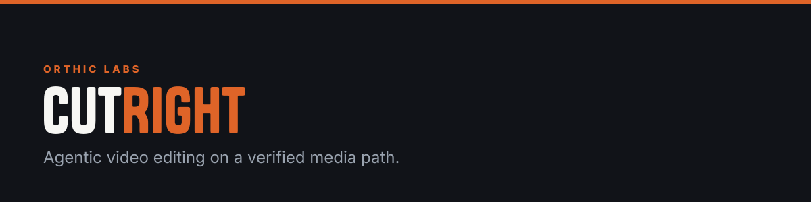
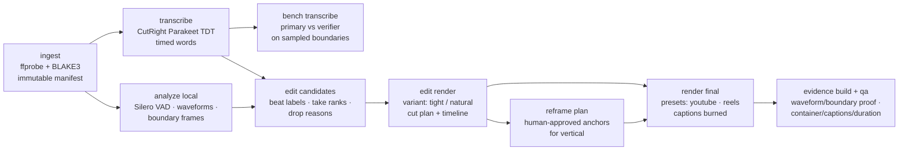

**Letting an agent cut video is easy. Trusting the cut is the hard part. CutRight is a local, headless editing pipeline where the media path is verified end to end: Rust owns project state, every FFmpeg call crosses a typed boundary, every source clip is BLAKE3-hashed before it can be cut, and the destructive steps are gated behind evidence and human approval.**


## The verified media path

- **Immutable, hashed inputs.** Ingest registers each source with a `blake3:` digest; a source outside an immutable registration is a hard error, and hashes are re-verified before use. Tests never copy or modify source files.
- **Typed FFprobe/FFmpeg boundaries.** Probes and renders go through typed structs (`ProbeResponse`, `RenderSegment`, `CaptionCue`, …), not assembled shell strings; encoder and filter capabilities are probed explicitly.
- **Two ASRs, not blind trust in one.** CutRight's own Parakeet TDT CoreML engine — built from vendored HeardRight source — supplies native timed words; an independent verifier checks word edges; Silero supplies real speech probabilities.
- **Rust owns the arithmetic.** Canonical project JSON, timestamp math, and cut plans live in one place, exposed only through the JSON-only `videoctl` CLI (with a global `--dry-run`).

## The pipeline



## Gates that refuse

- `bench transcribe` requires **at least three distinct immutable source clips** before either provider is authorized for destructive word-edge cuts — and without a resolved primary-vs-verifier decision, CutRight refuses to call a final render technically approved.
- Vertical delivery is blocked until `reframe plan` produces a human-reviewed plan with the top-level `approved` flag **and every anchor's** `approved` flag set. It will not silently center-crop a 16:9 cut into a vertical final.
- `evidence build` and `qa` produce the waveform/boundary-frame evidence and an explicit QA pass (container, captions, duration) before a render counts as approved.

## Provider stack

CutRight owns its speech runtime. The engine is built from vendored HeardRight source under `vendor/heardright`, and CutRight drives it over a supervised JSON-line stdin/stdout process. Models resolve only from a signed CutRight pack — there is no installed-HeardRight lookup, no sibling checkout, and no engine path override. VAD policy defaults: threshold 0.5, 16 kHz, min speech 160 ms, min silence 180 ms.

**Current state:** the speech pack ships as metadata only, so `discover_engine()` returns `runtime_pack_unavailable` and `transcribe --provider heardright` is not yet usable from an installed build. Deterministic ingest, analysis, cut, render, QA, and packaging do not depend on it.

WhisperX remains a development-time word-edge verifier running from a project-local Python venv, resolved via `CUTRIGHT_WHISPERX_PYTHON` (only needed when the venv isn't at the project-relative default or on `PATH`). `CUTRIGHT_FFMPEG` likewise points at a development FFmpeg. Both are development conveniences; a release build resolves the verifier and media tools from signed packs instead. Rough cuts use macOS `h264_videotoolbox`, and HDR input needs an FFmpeg build with `zscale`.

## Driving it

```sh
cargo test --workspace
cargo run -p videoctl -- doctor
cargo run -p videoctl -- project init  ~/MyVideo.video-project
cargo run -p videoctl -- ingest        ~/MyVideo.video-project clip.mp4
cargo run -p videoctl -- transcribe    ~/MyVideo.video-project --provider heardright
cargo run -p videoctl -- analyze local ~/MyVideo.video-project
cargo run -p videoctl -- edit candidates ~/MyVideo.video-project
cargo run -p videoctl -- edit render   ~/MyVideo.video-project --variant natural
cargo run -p videoctl -- bench transcribe ~/MyVideo.video-project
cargo run -p videoctl -- render final  ~/MyVideo.video-project --preset youtube
cargo run -p videoctl -- reframe plan  ~/MyVideo.video-project
# review analysis/reframe-plan.json, approve every anchor, then:
cargo run -p videoctl -- render final  ~/MyVideo.video-project --preset reels
cargo run -p videoctl -- evidence build ~/MyVideo.video-project
cargo run -p videoctl -- qa            ~/MyVideo.video-project --preset youtube
cargo run -p videoctl -- receipts verify ~/MyVideo.video-project
cargo run -p videoctl -- package social ~/MyVideo.video-project
```

The full surface spans 25 subcommands — project, ingest, transcribe, bench, analyze, edit, reframe, review, transcript remap, shorts propose, finish/slot, render, qa, package, OTIO export, and receipts verify — every one JSON-in/JSON-out.

## Around the pipeline

- **Studio** — a Tauri 2 + React 19 review shell (9 IPC commands) that reads project snapshots, re-verifies sources by BLAKE3, and appends hash-bound decisions to a JSONL ledger. Review surface only; the authoring surface is out of this repo's scope.
- **cutaway / finish** — absorbed natively. The rough cut and styling pass are now CutRight subcommands (`shorts propose`, `finish validate`) plus bundled skills under `skills/content-video-editor/`, driven by CutRight's own speech engine rather than an external Python verifier.

Not part of the local pipeline, by design: cloud analysis, effect/preset libraries, proxy generation, and preference learning.

## Licensing

Studio's bundled fonts (Tanker, Geist, Spline Sans Mono) ship under the ITF Free Font License and SIL OFL 1.1 respectively — see [`apps/studio/src/assets/fonts/LICENSES.md`](apps/studio/src/assets/fonts/LICENSES.md). The built app carries the same notice at `/LICENSES.md` (`apps/studio/public/LICENSES.md`, linked from `index.html`) so the notice travels with the shipped binary, per OFL.

## Status

The five-crate workspace (~7,200 lines of Rust) implements the full command surface above; the generated architecture doc tracks eight product flows whose pass/fail status the verifier has not yet resolved — treat them as implemented-but-unverified rather than proven, which is exactly the distinction this pipeline exists to enforce.

<!-- blueprint:docs:start -->
## Repository truth docs
- [Product overview](docs/product.md) — what this is and does (generated, code-grounded)
- [Architecture](docs/architecture.md) — components, flows, interfaces (generated, code-grounded)
<!-- blueprint:docs:end -->

---

<sub><b><a href="https://orthic-labs.github.io">Orthic Labs</a></b> — local-first infrastructure for AI-assisted development.<br>
<a href="https://github.com/Orthic-Labs/Membrane">Membrane</a> · <a href="https://github.com/Orthic-Labs/Cortex">Cortex</a> · <a href="https://github.com/Orthic-Labs/Sentinel">Sentinel</a> · <a href="https://github.com/Orthic-Labs/Roundtable">Roundtable</a> · <a href="https://github.com/Orthic-Labs/Morph">Morph</a> · <a href="https://github.com/Orthic-Labs/CutRight">CutRight</a> · <a href="https://github.com/Orthic-Labs/claudecodeX">claudecodeX</a></sub>
