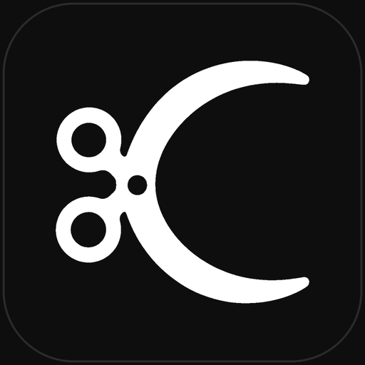
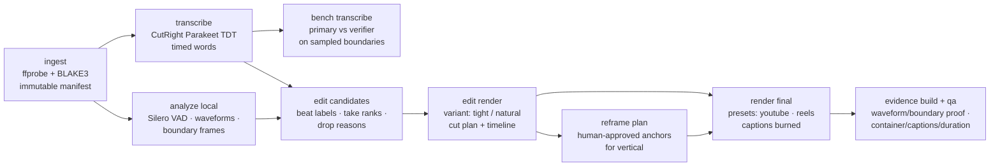

<p align="center">
  
</p>

<h1 align="center">CutRight</h1>

<p align="center"><strong>Offline video editing with evidence attached.</strong></p>

<p align="center">CutRight combines a desktop Studio, a Rust media kernel, & an embedded editing agent. Source media stays immutable, edits are typed transactions, uncertain decisions go to review, & final renders carry verification receipts.</p>

<p align="center">
  
  
  
</p>

## The verified media path

- **Immutable, hashed inputs.** Ingest registers each source with a `blake3:` digest; a source outside an immutable registration is a hard error, and hashes are re-verified before use. Tests never copy or modify source files.
- **Typed FFprobe/FFmpeg boundaries.** Probes and renders go through typed structs (`ProbeResponse`, `RenderSegment`, `CaptionCue`, …), not assembled shell strings; encoder and filter capabilities are probed explicitly.
- **Two ASRs, not blind trust in one.** CutRight's own Parakeet TDT CoreML engine — built from vendored HeardRight source — supplies native timed words; an independent verifier checks word edges; Silero supplies real speech probabilities.
- **Rust owns the arithmetic.** Canonical project JSON, timestamp math, and cut plans live in one place, exposed only through the JSON-only `videoctl` CLI (with a global `--dry-run`).

## One verified path



## Gates that refuse

- `bench transcribe` requires **at least three distinct immutable source clips** before either provider is authorized for destructive word-edge cuts — and without a resolved primary-vs-verifier decision, CutRight refuses to call a final render technically approved.
- Vertical delivery is blocked until `reframe plan` produces a human-reviewed plan with the top-level `approved` flag **and every anchor's** `approved` flag set. It will not silently center-crop a 16:9 cut into a vertical final.
- `evidence build` and `qa` produce the waveform/boundary-frame evidence and an explicit QA pass (container, captions, duration) before a render counts as approved.

## Provider stack

CutRight owns its speech runtime. The engine is built from vendored HeardRight source under `vendor/heardright`, and CutRight drives it over a supervised JSON-line stdin/stdout process. Models resolve only from a signed CutRight pack — there is no installed-HeardRight lookup, no sibling checkout, and no engine path override. VAD policy defaults: threshold 0.5, 16 kHz, min speech 160 ms, min silence 180 ms.

**Current state:** the speech pack ships as metadata only, so `discover_engine()` returns `runtime_pack_unavailable` and `transcribe --provider heardright` is not yet usable from an installed build. Deterministic ingest, analysis, cut, render, QA, and packaging do not depend on it.

WhisperX remains a development-time word-edge verifier running from a project-local Python venv, resolved via `CUTRIGHT_WHISPERX_PYTHON` (only needed when the venv isn't at the project-relative default or on `PATH`). `CUTRIGHT_FFMPEG` likewise points at a development FFmpeg. Both are development conveniences; a release build resolves the verifier and media tools from signed packs instead. Rough cuts use macOS `h264_videotoolbox`, and HDR input needs an FFmpeg build with `zscale`.

## Run it

```sh
bash scripts/gate.sh
cargo run -p videoctl -- doctor
cargo run -p videoctl -- project init  ~/MyVideo.video-project
cargo run -p videoctl -- ingest        ~/MyVideo.video-project clip.mp4
cargo run -p videoctl -- transcribe    ~/MyVideo.video-project --provider heardright
cargo run -p videoctl -- analyze local ~/MyVideo.video-project
cargo run -p videoctl -- edit candidates ~/MyVideo.video-project
cargo run -p videoctl -- edit render   ~/MyVideo.video-project --variant natural
cargo run -p videoctl -- bench transcribe ~/MyVideo.video-project
cargo run -p videoctl -- render final  ~/MyVideo.video-project --preset youtube
cargo run -p videoctl -- reframe plan  ~/MyVideo.video-project
# review analysis/reframe-plan.json, approve every anchor, then:
cargo run -p videoctl -- render final  ~/MyVideo.video-project --preset reels
cargo run -p videoctl -- evidence build ~/MyVideo.video-project
cargo run -p videoctl -- qa            ~/MyVideo.video-project --preset youtube
cargo run -p videoctl -- receipts verify ~/MyVideo.video-project
cargo run -p videoctl -- package social ~/MyVideo.video-project
```

`videoctl` exposes project, ingest, transcription, analysis, edit, review, render, QA, packaging, OTIO, & receipt surfaces as JSON-in/JSON-out commands. Use its global `--dry-run` before any effectful project command.

## Product surfaces

- **Studio** is the Tauri 2 + React 19 desktop editor for sources, transcript, story, beats, timeline, design, motion & sound, comparison, finals, QA, & receipts.
- **The media kernel** keeps canonical state, rational time, source hashes, actions, revisions, render graphs, evidence, jobs, recovery, & package integrity in Rust.
- **The embedded agent** uses the same typed actions as Studio & `videoctl`; confidence & policy decide whether it acts, asks for review, or stops.

Cloud execution is disabled by default. Consent starts off, budget starts at zero, & no production cloud provider ships in this repository.

## Licensing

Studio's bundled fonts (Tanker, Geist, Spline Sans Mono) ship under the ITF Free Font License and SIL OFL 1.1 respectively — see [`apps/studio/src/assets/fonts/LICENSES.md`](apps/studio/src/assets/fonts/LICENSES.md). The built app carries the same notice at `/LICENSES.md` (`apps/studio/public/LICENSES.md`, linked from `index.html`) so the notice travels with the shipped binary, per OFL.

## Status

[`scripts/gate.sh`](scripts/gate.sh) is the repository gate.

CutRight v2 is implemented across 21 Rust crates & Studio. Current macOS 0.1.5 build is signed & notarized. Fresh-user macOS qualification remains open in [`STATUS.md`](STATUS.md).

<!-- blueprint:docs:start -->
## Repository truth docs
- [Product overview](docs/product.md) — what this is and does (generated, code-grounded)
- [Architecture](docs/architecture.md) — components, flows, interfaces (generated, code-grounded)
<!-- blueprint:docs:end -->

---

<sub><b><a href="https://orthic-labs.github.io">Orthic Labs</a></b> — local-first infrastructure for AI-assisted development.<br>
<a href="https://github.com/Orthic-Labs/Membrane">Membrane</a> · <a href="https://github.com/Orthic-Labs/Cortex">Cortex</a> · <a href="https://github.com/Orthic-Labs/Sentinel">Sentinel</a> · <a href="https://github.com/Orthic-Labs/Roundtable">Roundtable</a> · <a href="https://github.com/Orthic-Labs/Morph">Morph</a> · <a href="https://github.com/Orthic-Labs/CutRight">CutRight</a> · <a href="https://github.com/Orthic-Labs/claudecodeX">claudecodeX</a></sub>
