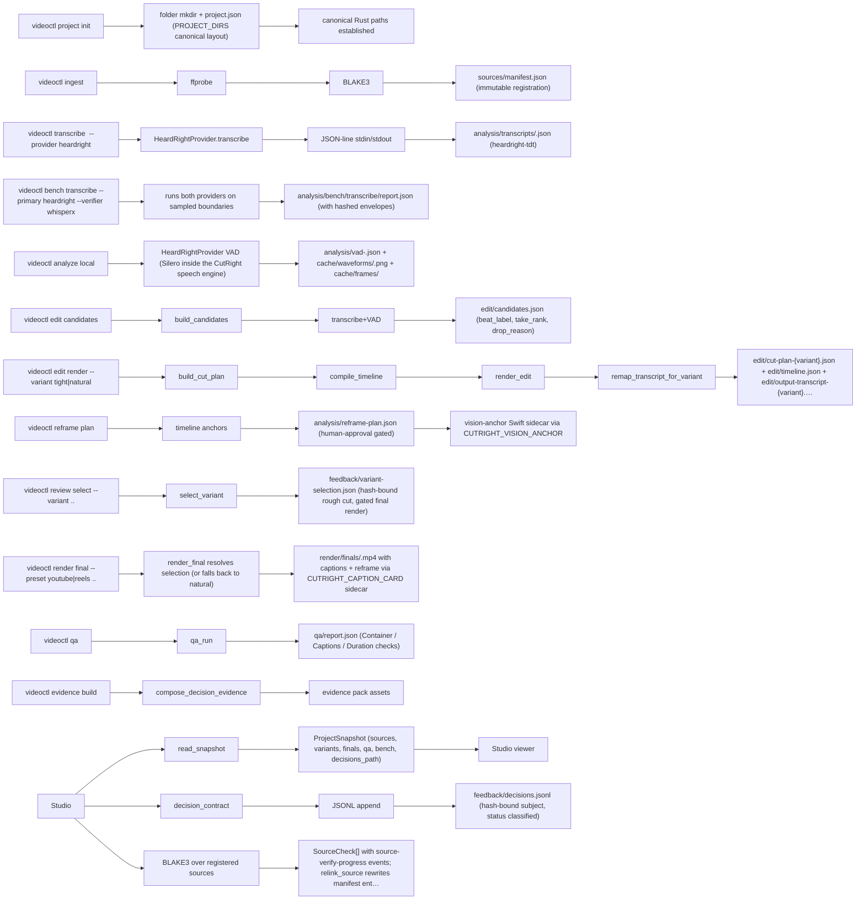

> ## ⚠️ RECONCILE — 7 DECISIONS NEEDED (blocker)
> The code and the docs disagree on 7 things (all `partially_verified` — line numbers stale, behaviour matches). You decide how to reconcile each. Nothing else here matters until these are settled.
>
> | # | The doc says | The code actually does | Verdict | Proposed fix | Your call |
> |---|---|---|---|---|---|
| 1 | "5. **Auto vs suggest:** automatic removal only for high-confidence classes (aban…" — `ARCHITECTURE-2026-07-26.md:251` | Auto-remove classes match (false starts, dups, dead air); suggest-only list matches FillerPolicy::Su | **CODE-IS-BETTER** | Update ARCHITECTURE-2026-07-26.md:251 to match current code references per Phase 2 verdict claim.arc | ☐ |
| 2 | "hook, and a confidence on every decision that drives escalation.…" — `docs/EDITORIAL-BRAIN.md:12` | Integration-point line numbers stale: doc says build_candidates at 1085 and build_cut_plan at 1276,  | **CODE-IS-BETTER** | Update docs/EDITORIAL-BRAIN.md:12 to match current code references per Phase 2 verdict claim.docs-ed | ☐ |
| 3 | "`build_candidates` (lib.rs:1085) today groups words by a fixed 900 ms gap and em…" — `docs/EDITORIAL-BRAIN.md:16` | 900ms gap grouping confirmed (line 1243 and group_words at 2784); line numbers in doc (1085/1276) ar | **CODE-IS-BETTER** | Update docs/EDITORIAL-BRAIN.md:16 to match current code references per Phase 2 verdict claim.docs-ed | ☐ |
| 4 | "pause; merge fragments that complete one thought. Each beat gets a `beat_label` …" — `docs/EDITORIAL-BRAIN.md:59` | Beat label vocabulary matches implementation; split heuristics (speaker change/topic shift/pause) li | **CODE-IS-BETTER** | Update docs/EDITORIAL-BRAIN.md:59 to match current code references per Phase 2 verdict claim.docs-ed | ☐ |
| 5 | "schema + migrations when this contract is implemented.…" — `docs/HANDOFF-CONTRACTS.md:273` | Spec says brief/handoffs/ is an addition to the canonical package layout; implies a schema migration | **CODE-IS-BETTER** | Update docs/HANDOFF-CONTRACTS.md:273 to match current code references per Phase 2 verdict claim.docs | ☐ |
| 6 | "Implemented in this checkout:…" — `docs/PHASE-0.md:5` | Spec lists 'Implemented in this checkout' items; the Rust workspace includes video-core/video-projec | **CODE-IS-BETTER** | Update docs/PHASE-0.md:5 to match current code references per Phase 2 verdict claim.docs-phase-0-md. | ☐ |
| 7 | "implemented — the workflow that needs each one says so.…" — `skills/content-video-editor/SKILL.md:84` | Listed commands match the CLI surface; 'review select' and a few others are marked (planned) per the | **CODE-IS-BETTER** | Update skills/content-video-editor/SKILL.md:84 to match current code references per Phase 2 verdict  | ☐ |
> ## ⚠️ RECONCILE — 7 DECISIONS NEEDED (blocker)
> The code and the docs disagree on 7 things (all `partially_verified` — line numbers stale, behaviour matches). You decide how to reconcile each. Nothing else here matters until these are settled.
>
> | # | The doc says | The code actually does | Verdict | Proposed fix | Your call |
> |---|---|---|---|---|---|
| 1 | "5. **Auto vs suggest:** automatic removal only for high-confidence classes (aban…" — `ARCHITECTURE-2026-07-26.md:251` | Auto-remove classes match (false starts, dups, dead air); suggest-only list matches FillerPolicy::Su | **CODE-IS-BETTER** | Update ARCHITECTURE-2026-07-26.md:251 to match current code references per Phase 2 verdict claim.arc | ☐ |
| 2 | "hook, and a confidence on every decision that drives escalation.…" — `docs/EDITORIAL-BRAIN.md:12` | Integration-point line numbers stale: doc says build_candidates at 1085 and build_cut_plan at 1276,  | **CODE-IS-BETTER** | Update docs/EDITORIAL-BRAIN.md:12 to match current code references per Phase 2 verdict claim.docs-ed | ☐ |
| 3 | "`build_candidates` (lib.rs:1085) today groups words by a fixed 900 ms gap and em…" — `docs/EDITORIAL-BRAIN.md:16` | 900ms gap grouping confirmed (line 1243 and group_words at 2784); line numbers in doc (1085/1276) ar | **CODE-IS-BETTER** | Update docs/EDITORIAL-BRAIN.md:16 to match current code references per Phase 2 verdict claim.docs-ed | ☐ |
| 4 | "pause; merge fragments that complete one thought. Each beat gets a `beat_label` …" — `docs/EDITORIAL-BRAIN.md:59` | Beat label vocabulary matches implementation; split heuristics (speaker change/topic shift/pause) li | **CODE-IS-BETTER** | Update docs/EDITORIAL-BRAIN.md:59 to match current code references per Phase 2 verdict claim.docs-ed | ☐ |
| 5 | "schema + migrations when this contract is implemented.…" — `docs/HANDOFF-CONTRACTS.md:273` | Spec says brief/handoffs/ is an addition to the canonical package layout; implies a schema migration | **CODE-IS-BETTER** | Update docs/HANDOFF-CONTRACTS.md:273 to match current code references per Phase 2 verdict claim.docs | ☐ |
| 6 | "Implemented in this checkout:…" — `docs/PHASE-0.md:5` | Spec lists 'Implemented in this checkout' items; the Rust workspace includes video-core/video-projec | **CODE-IS-BETTER** | Update docs/PHASE-0.md:5 to match current code references per Phase 2 verdict claim.docs-phase-0-md. | ☐ |
| 7 | "implemented — the workflow that needs each one says so.…" — `skills/content-video-editor/SKILL.md:84` | Listed commands match the CLI surface; 'review select' and a few others are marked (planned) per the | **CODE-IS-BETTER** | Update skills/content-video-editor/SKILL.md:84 to match current code references per Phase 2 verdict  | ☐ |

<!-- generated by blueprint 0.2.0 gen:512d7cc08470e0de0f4afe4a921117e4 — edit code/docs sources, not this file -->

# cutright — Architecture

Technical overview of components, interfaces, classified flow inventory, and capability coverage.
The deterministic Phase-1 graph supplies the evidence substrate; Phase-2 understanding supplies
the human component names and operational flow. Raw file and symbol nodes are intentionally omitted.

CutRight is a local agentic video editing engine: Rust workspace (video-core/video-media/video-providers/video-project/video-cli) wiring a JSON-only videoctl control plane to a Tauri 2 Studio shell (React 19 + Rust core). Sources are immutable BLAKE3-registered media; transcription is provided by CutRight's own Parakeet TDT engine — built from vendored HeardRight source, resolved only from signed CutRight packs — over a JSON-line protocol, with an independent word-edge verifier; renders are produced by FFmpeg/zimg caption-card pipelines with macOS-side Swift sidecars. The Studio IPC surface is 9 commands and videoctl exposes ~25 subcommands, of which init/migrate/ingest/transcribe/bench/analyze/reframe/evidence/edit(render)/render.final/qa/select paths are wired.

## Final-output encoder decision (CR-F-B8-004)

Final delivery remains Rust-owned FFmpeg `libx264` plus AAC, selected by each YouTube/Reels color profile; this is the deterministic release path. `h264_videotoolbox` remains limited to rough/preview renders, while archival/master output uses software `prores_ks` plus PCM. The macOS Swift sidecar supplies native media inspection, captions, previews, and timeline transforms, but never replaces final-output encoding.

## System workflow



_(source: .agent/understanding.json:architecture.dataFlow)_

## Components

- **videoctl CLI entry** _(source: crates/video-cli/src/main.rs:246-424)_
- **video-project project orchestration** _(source: crates/video-project/src/lib.rs:23-47,79-228,611-694,825-1130,1127-1340,1348-1450,1503-2080,2087-2210,2210-2430,2314-2430,2433-2570,2573-3380)_
- **video-core domain models** _(source: crates/video-core/src/lib.rs:1-10; crates/video-core/src/models.rs:1-30; crates/video-core/src/timestamp.rs:1-12; crates/video-core/src/providers.rs:1-46)_
- **video-media rendering** _(source: crates/video-media/src/lib.rs:131,163,241,325,382,495,530,561,600,641,675,698,709,740,1020,1060,820-870,924-940,956-968)_
- **video-providers provider shim** _(source: crates/video-providers/src/lib.rs:20-32,84-103,217-253)_
- **Video-side sidecar workers** _(source: crates/video-project/build.rs:14-32; crates/video-media/build.rs:8-26; crates/video-providers/build.rs:1-9)_
- **Studio Tauri Rust core** _(source: apps/studio/src-tauri/src/main.rs:97-304)_
- **decision_contract module** _(source: apps/studio/src-tauri/src/decision_contract.rs:1-46; apps/studio/src-tauri/src/main.rs:142-160)_
- **Studio React UI** _(source: apps/studio/src/main.tsx:83-1140,1553-1780)_
- **Studio contracts/review shared types** _(source: apps/studio/src/contracts/review.ts:5-265)_
- **Hardening gate** _(source: scripts/gate.sh:1-170)_
- **Asset-license gate** _(source: scripts/resolve-license.sh:1-183)_
- **Headless browser QA lane** _(source: apps/studio/scripts/qa-browser.sh:1-7; apps/studio/scripts/qa-browser-stop.sh:1-11)_

## Flow inventory

| Flow | Status | Evidence | Impact |
|---|---|---|---|
| source video ingest -> timeline | undetermined | crates/video-cli/src/main.rs:274-288; crates/video-project/src/lib.rs:23-47,96-105 |  |
| transcription candidate generation | undetermined | crates/video-cli/src/main.rs:289-312; crates/video-project/src/lib.rs:611-1126 |  |
| cut-plan render | undetermined | crates/video-cli/src/main.rs:338-347; crates/video-project/src/lib.rs:1503-2080 |  |
| studio review | undetermined | apps/studio/src/main.tsx:335-1118; apps/studio/src-tauri/src/main.rs:97-304 |  |
| caption render | undetermined | crates/video-media/src/lib.rs:698-740,1020-1086 |  |
| reframe plan (human-approved) | undetermined | crates/video-cli/src/main.rs:318-322; crates/video-project/src/lib.rs:1385-1450 |  |
| final render (selection-gated) | undetermined | crates/video-cli/src/main.rs:355-364; crates/video-project/src/lib.rs:2087-2430 |  |
| explicit-final QA | undetermined | crates/video-cli/src/main.rs:372-379; crates/video-project/src/lib.rs:2314-2430 |  |

## Capability coverage

| Capability | Status | Evidence | Provider |
|---|---|---|---|
| document_claims | covered | ARCHITECTURE-2026-07-26.md, README.md, docs/PHASE-0.md, docs/PHASE-1.md | blueprint-static |
| precedence | covered | Decision ledger status classification | blueprint-static |
| code_symbols | covered | crates/video-project/src/lib.rs (3834 lines) + 5 distinct crates + Studio Rust 1387 lines + Studio TSX 1780 lines | blueprint-treesitter |
| code_relationships | covered | Cargo.toml workspace members | blueprint-treesitter |
| task_retrieval | covered | .agent/runs/e2e-understanding-of-the-cutright-repo/TASK-BRIEF.md, prep/docs/*.outline.json | blueprint-static |
| contradiction_arbitration | partial | README.md:108-112 declares docs/architecture.md as generated; prep pipeline emits outlines; silero-vad-macos.swift persists while build.rs is no-op | blueprint-static |

## Health & Security (loud-partial when graph is missing)

- Stale claims: **2** _(source: .agent/stale.json:staleClaims)_
- Missing references: **134** _(source: .agent/stale.json:missingReferences)_
- Detailed health and security findings live in `.agent/understanding.json`; every synthesized
  component and flow above retains its recorded evidence. _(source: .agent/understanding.json)_

## Status

Generated from index signature `512d7cc08470e0de0f4afe4a921117e4`. Unchanged-repo rebuilds are byte-identical.

## Enforced crate dependency DAG

CR-F-B2-001 freezes this dependency direction, and `scripts/check-crate-dag.py`
enforces it from every local Cargo path dependency before Rust checks run:

```text
Studio / videoctl / cutright-mcp
              |
        video-daemon
              |
        video-services
              |
        video-project
              |
 domain crates: video-actions, video-capabilities, video-core, video-editorial,
 video-jobs, video-media, video-providers, video-runtime, video-security,
 video-sessions, video-state
```

Lower crates cannot depend upward. In particular, `video-driver-host` may not
depend on `video-project`, `video-state`, project storage, or `ActionExecutor`;
`video-protocol` owns transport DTOs only and may not depend on project,
state, actions, or services. The gate reports each violating edge by name.

The Local Director remains an offline route: it plans from locally retrieved
evidence and emits typed requests, while deterministic Rust services own
arithmetic, media boundaries, project state, and mutations. No network or
remote provider is required for this route.
